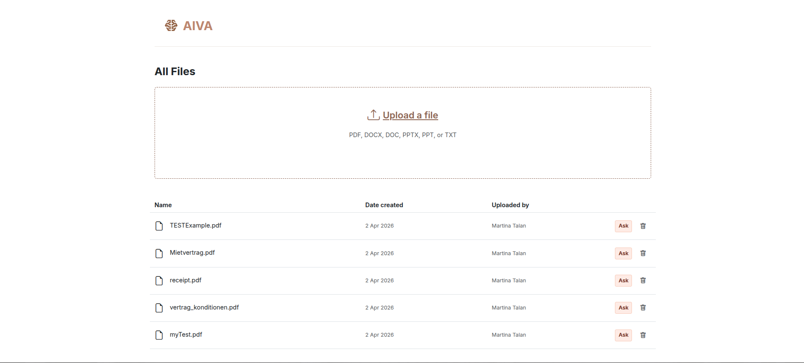
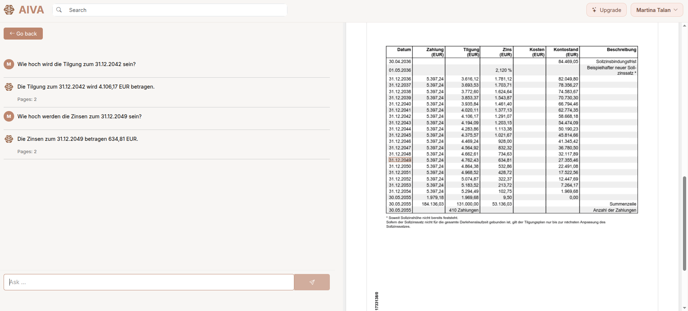
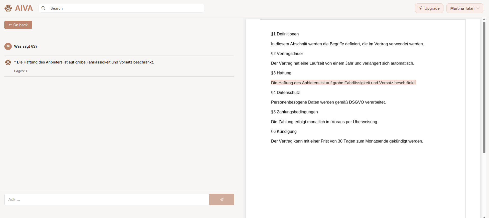
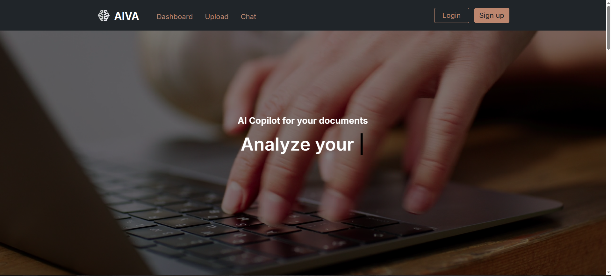

# AI Copilot for Technical Documents

An AI-powered chat assistant that analyzes technical documents and answers user questions based on context.

The system combines modern full-stack development with Retrieval-Augmented Generation (RAG) to deliver accurate answers, including source references and PDF highlighting.


## 🚀 Overview

This project demonstrates a complete end-to-end AI application:

- Documents are uploaded and processed
- Content is split into structured and semantic chunks
- Embeddings are generated and stored in a vector database
- Users ask questions via a chat interface
- The AI returns context-aware answers with sources and highlights

👉 Focus: **Full-stack architecture + real-world AI application design**


## 🛠️ Tech Stack & Architecture

### Frontend
- Vue 3 (Composition API)
- Pinia (state management)
- Vue Router
- Bootstrap (UI)
- PDF.js (document rendering & highlighting)
- WebSockets (real-time streaming)
- Axios (API communication)

### Backend
- NestJS (modular architecture)
- TypeORM (database layer)
- PostgreSQL (data persistence)
- JWT (authentication & authorization)

### AI / RAG Layer
- OpenAI API (embeddings + LLM)
- FAISS (vector search)
- Custom retrieval & ranking logic
- Semantic + structural text chunking

### Dev & Infrastructure
- Docker (containerization)
- REST + WebSocket architecture
- Vitest / Cypress (testing)


## ⚙️ Features

- JWT-based authentication
- Document upload (PDF/Text)
- Intelligent text chunking (semantic & structural)
- Vector search with FAISS
- Chat with streaming responses (WebSocket)
- Source references per answer (page-level)
- Automatic PDF highlighting of relevant content
- Chat history per document


## 🏗️ Architecture

```plaintext
ai-copilot/
├── frontend/              # Vue 3 Chat UI + PDF Viewer
├── backend/               # NestJS API (Auth, Documents, Chat)
├── python-rag-service/    # AI service (RAG, Embeddings, Retrieval)
└── README.md
```

## 🧠 Motivation

This project is part of my effort to deepen my understanding of generative AI and integrate it into my existing full-stack skill set.

The focus is on combining modern web development with AI capabilities to build more intelligent and practical applications.

## 🧠 Key Challenges

- Designing an effective chunking strategy for technical documents
- Ensuring accurate retrieval and ranking of relevant context
- Mapping AI-generated answers back to exact PDF coordinates
- Handling streaming responses while keeping UI responsive

## 🔄 Data Flow

1. User uploads a document  
2. Backend stores file and metadata  
3. AI service:
   - extracts text  
   - splits into chunks  
   - generates embeddings  
   - stores them in FAISS  
4. User sends a question via chat  
5. Relevant chunks are retrieved and ranked  
6. OpenAI generates a context-aware answer  
7. Answer + sources are returned to the frontend  
8. Relevant content is highlighted in the PDF  


## 📸 Screenshots

### Document Dashboard


### Chat Interface


### PDF Highlighting


### Home page


## 📌 Status

- Actively developed — new features and improvements are continuously being added.


